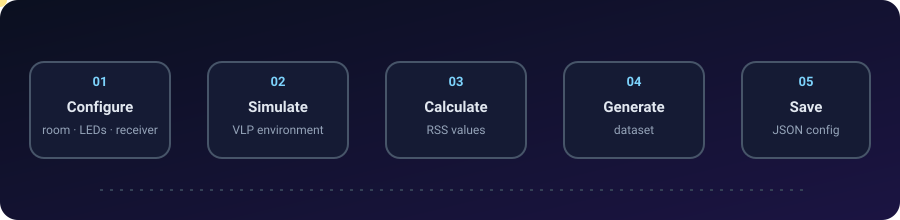
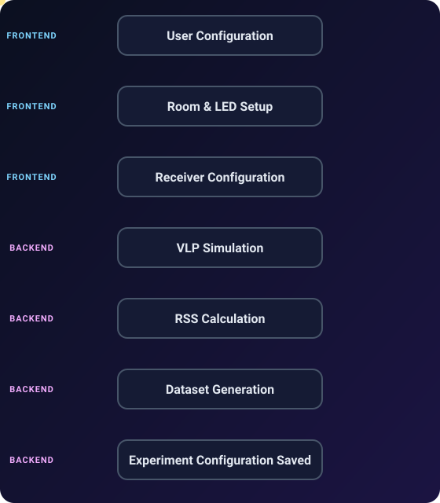

<div align="center">



<p>
  
  
  
  
  
</p>

</div>

# VLP Lab

Visible Light Positioning simulation and dataset generation platform for researchers and students.

<p align="center">
  
</p>

VLP Lab provides a configurable environment for creating VLP simulations and generating RSS-based datasets. The platform combines an interactive web interface with a Python backend that performs the simulation and dataset-generation calculations.

## What VLP Lab Does

VLP Lab allows users to configure and experiment with a virtual VLP environment without manually writing a separate simulation script for every experiment.

The platform is built around three main parts:

* **Simulation configuration** — define the virtual room, LEDs, receiver, and simulation parameters.
* **VLP calculation** — the backend performs the required physics and RSS calculations.
* **Dataset generation** — simulation results are collected into datasets for further research and analysis.

<p align="center">
  
</p>

## Features

* Configure virtual room dimensions.
* Add and configure multiple LEDs.
* Configure receiver position and movement.
* Run RSS-based VLP simulations.
* Visualize the simulation environment in 3D.
* Generate datasets from simulation results.
* Save experiment configurations as JSON.
* Use generated datasets for further analysis and research.

## Technology Stack

| Component           | Technology        |
| ------------------- | ----------------- |
| Frontend            | React             |
| 3D Visualization    | React Three Fiber |
| Backend API         | FastAPI           |
| Numerical Computing | NumPy             |
| Data Processing     | Pandas            |
| Testing             | Pytest            |
| Experiment Storage  | JSON              |

All VLP physics and dataset-generation calculations are handled by the backend.

## How It Works

<p align="center">
  
</p>

The frontend handles the user interface and 3D visualization, while the FastAPI backend handles the simulation logic, VLP calculations, and dataset generation.

## Project Structure

```text
vlp-dataset-generator/
├── backend/
│   ├── app/
│   └── requirements.txt
├── frontend/
├── configs/
│   └── experiments/
├── assets/
├── tests/
└── README.md
```

## Requirements

* Python 3.10+
* Node.js 18+
* npm

## Run the Project

The frontend and backend run separately, so two terminals are required.

### Terminal 1 — Backend

```bash
cd backend

python -m venv .venv

# Windows
.venv\Scripts\activate

# macOS/Linux
source .venv/bin/activate

pip install -r requirements.txt

uvicorn app.main:app --reload --port 8000
```

Backend API:

`http://localhost:8000`

Interactive API documentation:

`http://localhost:8000/docs`

### Terminal 2 — Frontend

```bash
cd frontend

npm install
npm run dev
```

Frontend:

`http://localhost:5173`

Open the frontend URL in your browser to use VLP Lab.

## Tests

```bash
pip install -r backend/requirements.txt
pytest tests
```

## Experiments

Saved experiment configurations are stored as JSON files in:

```text
configs/experiments/
```

This makes it possible to keep the configuration used for an experiment and reuse it later.

## Development

VLP Lab is currently under active development. Future development may include additional simulation parameters, visualization features, dataset-generation options, and experiment-management capabilities.
